# 레바의 모험 모작 첫 작업! 캐릭터 제작!
레바의 모험 모작의 첫 작업으로    
게임에 쓸 캐릭터 리소스를 제작해보았다.     
일단 하나의 캐릭터를 제작해보고 나중에 다른 캐릭터들도 제작할 예정이다.   
     
가장 먼저 제작할 캐릭터는 **내 주력캐릭터인 "웨펀마스터"다.**  
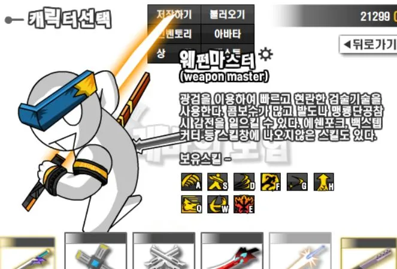      
 
일단 게임의 리소스를 만들 때 사용할 툴로 "**Aseprite**를 사용할 것이다.    
그림을 못 그리는 내가 그나마 찍을 수 있는게 도트이기 때문에 캐릭터는 원작과는 다른 방식으로 제작 해야 할 것 같다.    
## 애니메이션 형식
 
캐릭터 애니메이션 같은 경우에는 2가지 방식 중에서 선택해야했다.

> - **스프라이트 애니메이션** : 여러장의 그림을 재생시키는 방식의 애니메이션    
> - **스켈레톤 애니메이션**: 2D에 뼈를 심어 3D처럼 뼈대를 움직여 만드는 애니메이션

이 2가지 방식중에서 프밍인 내가 빠르게 리소스를 뽑아낼 수 있는 스켈레톤 애니메이션을 사용해서 리소스를 뽑았다.    
스프라이트 애니메이션은 모션 하나하나를 그려야해서 시간을 많이 소비할 수 밖에 없다...  
         
스켈레톤 애니메이션은 다 만들어진 캐릭터에 뼈를 심고 움직이면서 애니메이션을 찍으면 되기 때문에 쉽고 빠르게 작업되지만 사용자의 숙련도에 따라 퀄리티의 차이가 심하다. 비록 많이 사용해본 적은 없지만 그래도 이번 기회에 스켈레톤 애니메이션을 제작해보면서 실력이 늘었으면 좋겠다.

## 유니티 공식 스켈레톤 애니메이션 기능!

[공식 문서(2D Animation)](https://docs.unity3d.com/Packages/com.unity.2d.animation@11.0/manual/index.html) & [공식 가이드(유튜브)](https://www.youtube.com/watch?v=b3J2SInvuwM&t=6s)   
원래 스켈레톤 애니메이션하면 가장 먼저 떠오르는 건 스파인이란 프로그램이지만 유료이고    
좀 더 접근성 좋은 프로그램을 찾던 중 유니티 공식 기능인 **"2D Animation"** 을 찾았다.     
    
유니티에서 PSD파일을 받아와서 뼈를 심을 수 있는 기능이다.    
스파인보단 부가 기능은 적지만 어차피 엄청나게 고퀄리티로 만들 것은 아니니까 만족하면서 사용중이다.    
바로 사용 방법에 대해 알아보자!

## 사용 방법

일단 사용하기 전 만들어진 캐릭터가 있어야한다.    
난 도트로 캐릭터를 찍어보았다.
> ### 1. 캐릭터 준비
> 웨폰마스터 캐릭터를 도트로 그려왔다.
>  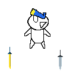 
>
> ### 2. 캐릭터 분리
> 포토샵에서 편집하기 좋게 캐릭터의 움직일 부분을 분리한다.
>  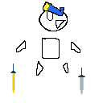 
> Aseprite에서 캐릭터 작업할 때 레이어 나눠서 작업하면 분리하는데 편하다!
> ### 3. 포토샵 레이어 편집
> 분리한 관절마다 포토샵에서 레이어로 나눠준 후 다시 재조립한다.
>  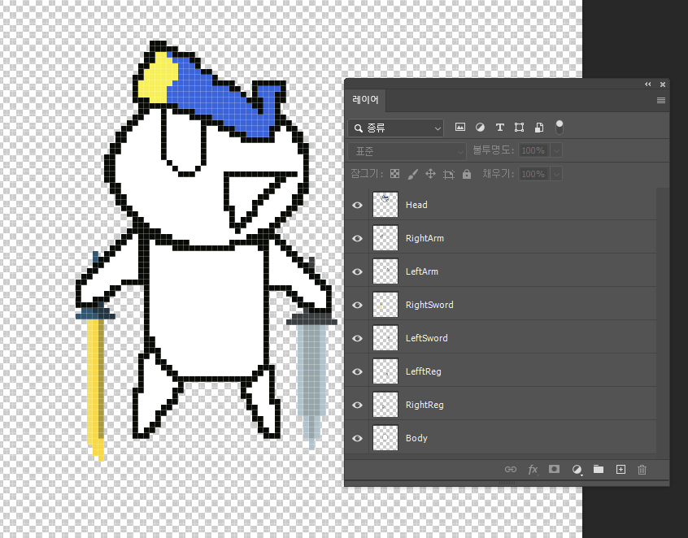 
> 관절이 들어가 움직이기때문에 움직일 부분마다 분리해주자
> ### 4. 포토샵 PSB저장
> **파일 -> 다른 이름으로 저장**에서 저장 형식을 **대용량 문서 형식(PSB)** 으로 저장한다.
>  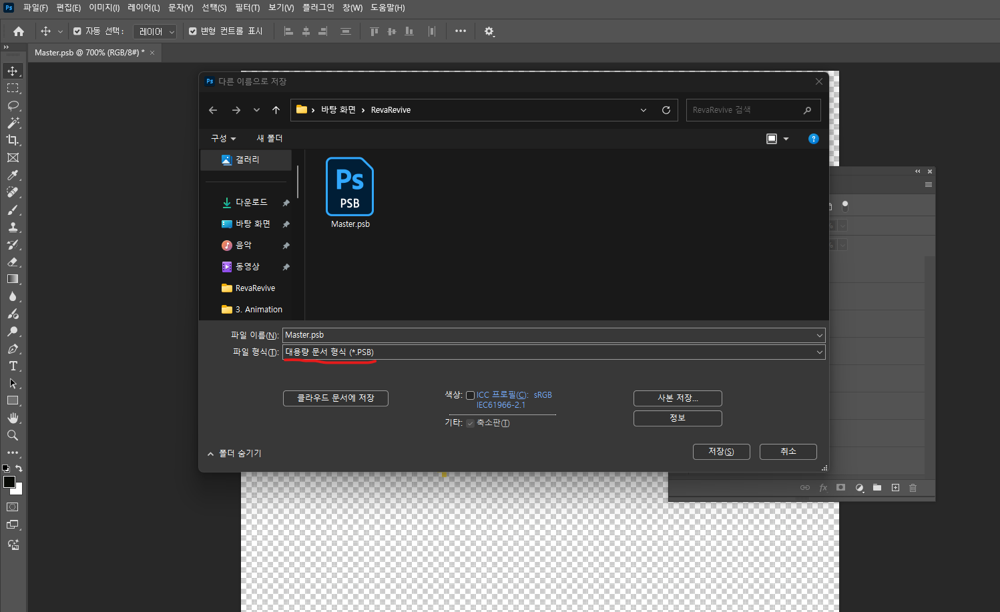 
> 주의! PSD형식 아님!
> ### 5. 유니티에서 불러오기
> 유니티에서 저장한 PSB파일을 그대로 드래그해서 넣으면 그린 캐릭터가 생긴다!
>  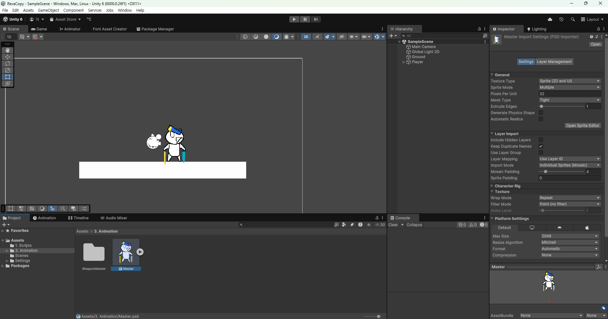 
> 만들어진 캐릭터에 기본 설정을 하면된다.    
> 난 도트로 만들 것이기때문에 **Filter Mode**와 **Compression**을    
> 각각 Point(no filter), none으로 바꿔줬다.
> ### 6. 뼈(Bone) 생성
> 인스펙터에서 **Open Sprite Editor**를 클릭해서 스프라이트 에디터 창에 들어가보면
>  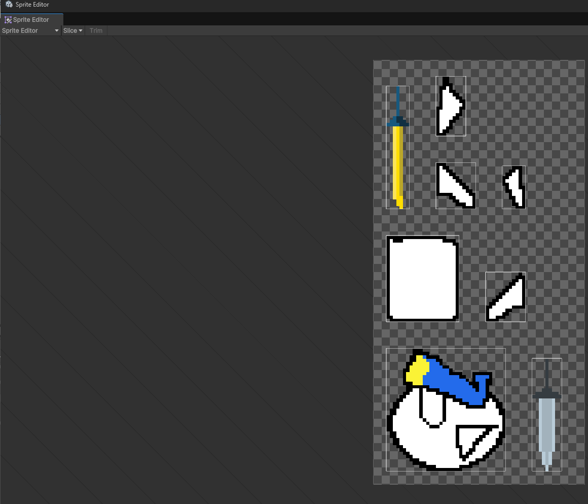 
> 캐릭터가 레이어대로 분리되어있다. 슬라이스(하얀테두리)가 되어 있으면 정상이다.   
> 여기서 왼쪽 상단에 **Sprite Editor**를 클릭해 **Skinning Editor**를 클릭한다.
>  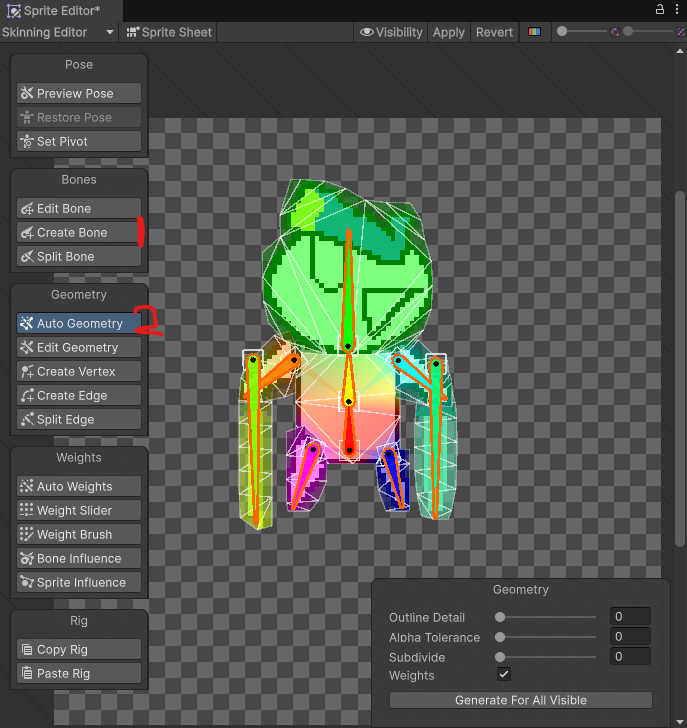 
> 캐릭터가 다시 조립되고 드디어 뼈를 심을 수 있다.    
> 먼저 **Create Bone**을 이용해 캐릭터에게 뼈를 심을 수 있다.    
> 뼈는 마우스 우클릭으로 뼈를 심을 수 있다. 좌클릭은 뼈 연속 연결해제이고    
> Delete키를 눌러 뼈를 지울 수 있다.     
> 뼈를 다 생성한 이후 뼈 전체 선택(드래그),    
> **Auto Geometry**를 이용해 뼈와 살(메쉬)를 연결 할 수 있다.    
> 처음에 연결을 진행 했을 때 색깔이 알록달록하게 칠해져 있는 것은 뼈의 색과 관련있다.    
>
> 색깔이 칠해져 있는 비중이 그 부분이 뼈가 얼마나 간섭하는지를 나타낸다.   
> 원치 않는 뼈가 간섭되는 것을 해결하기 위해 각 메쉬에 대해 뼈를 할당해줄 것이다.     
>  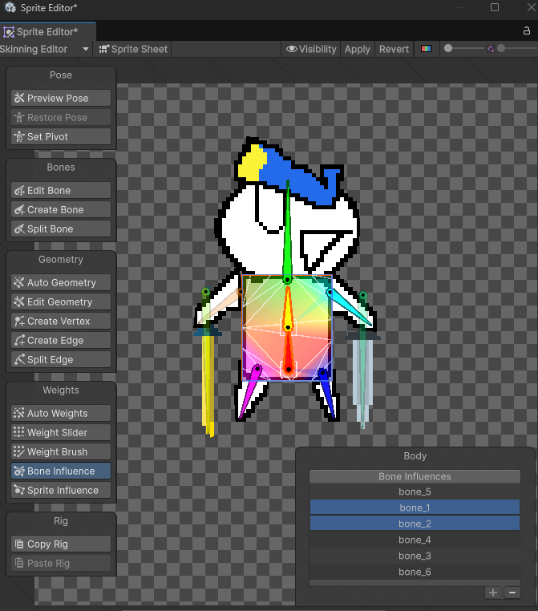 
> **Bone Influence**를 클릭하고 분리된 부위를 클릭해보면 어떤 뼈가 간섭하고 있는지를 확인 할 수 있다.   
> 우리는 주황색, 노랑색 몸통 뼈만 필요하니 나머지는 -버튼을 눌러 해제해주면 된다.    
> 이걸 모든 부위에 설정해주면 된다!       
>  
> 캐릭터를 자세히 보면 어딘가 깨져있거나 울퉁불퉁한 부분이 있을 것이다.   
> 그럴땐 **Edit Geometry**를 클릭하여 분리된 부분의 메쉬를 늘려서 수정하면 된다.   
> 모든 과정이 끝나고 어색함이 없으면 상단에 **Apply**를 눌러 저장하면 된다
 
## 애니메이션 제작!

 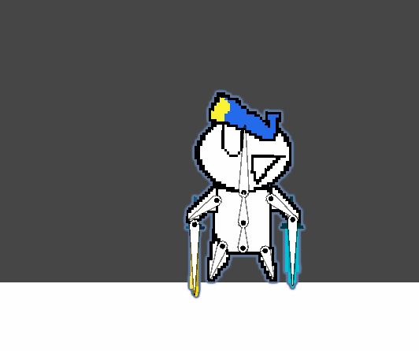 
이제 뼈를 다 박았으면 이렇게 캐릭터를 하이어라키에 놓았을 때 설정해준 뼈들이 보이게된다.    
이제 이 뼈들로 애니메이션을 제작할 수 있다.   
이 오브젝트에 애니메이션 클립을 추가하고 녹화 버튼을 누르고 뼈를 회전, 움직여서 애니메이션을 찍으면 된다!
  
사용자의 숙련도, 캐릭터의 완성도에 따라 애니메이션의 퀄리티가 달라지지만 스프라이트 방식의 애니메이션보다    
 빠르게 제작할 수 있다는 것이 장점이라고 생각한다.    
 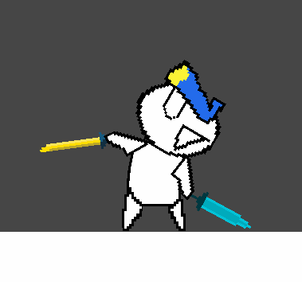 
스켈레톤 애니메이션을 이용해서 캐릭터의 Idle, Move, Jump, Attack, Combo 등 다양한 애니메이션을 찍었다!

## 마무리!
오늘은 이렇게 레바의 모험의 첫 작업! 캐릭터 리소스를 뽑아보았다.    
1인 개발로 프밍도 하면서 혼자 그래픽 리소스까지 뽑는 것이 쉽지는 않지만 열심히 해볼려고 노력중이다.    
일단 웨펀마스터 먼저 만들고 다른 직업군들은 1차적으로 게임을 다 완성했을 때 추가해볼 예정이다.   
레바의 모험 원작과 캐릭터 디자인이나 모션, 게임 엔진조차 다르지만 레바의 모험에서 느꼈던   
그 느낌을 살릴 수 있도록 더 노력해야겠다.
